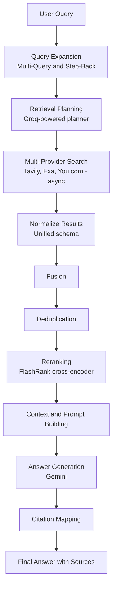

## 🔍 QueryMind

🌐 **Live Demo:** [QueryMind](https://query-mind-ochre.vercel.app/)


**QueryMind** is an open-source, retrieval-first AI research assistant — inspired by Perplexity-style AI search. It takes a single question, expands it into multiple search angles, plans which search providers to use, retrieves and fuses results from across the web, reranks them for relevance, and generates a grounded answer with source citations.

---

## How it works



1. **Query Expansion** — generates paraphrased and "step-back" (broader conceptual) variants of your query, with automatic fallback across Gemini, Groq, OpenRouter, and a local LLM.
2. **Retrieval Planning** — a Groq-powered planner classifies the intent of each query variant and decides which providers and depth to use, with a heuristic fallback if the planner output is invalid.
3. **Multi-Provider Search** — runs Tavily, Exa, and You.com searches in parallel via `asyncio`, with provider-specific strategies based on intent (freshness, research, factoid, etc.).
4. **Normalization, Fusion & Deduplication** — all provider results are mapped into a single `UnifiedRetrievalResult` schema, scored, and deduplicated by URL.
5. **Reranking** — a FlashRank cross-encoder reranks the merged result set against the original query.
6. **Context & Prompt Building** — the top results are assembled into a structured context block, with intent-aware prompting (general / research / educational / summary).
7. **Answer Generation** — Gemini generates the final answer grounded in the retrieved context.
8. **Citation Mapping** — sources are mapped back to the answer and appended as references.

---

## Features

- ✅ Multi-query + step-back query expansion with multi-provider fallback (Gemini → Groq → OpenRouter → local LLM)
- ✅ LLM-based retrieval planning with intent classification, tool routing, and heuristic fallback
- ✅ Async parallel multi-provider search (Tavily, Exa, You.com)
- ✅ Unified result normalization, fusion, and URL-based deduplication
- ✅ FlashRank cross-encoder reranking
- ✅ Grounded answer generation with source citations
- ✅ Async FastAPI backend with job-based polling (`/query` → `/response/{id}`)
- ✅ React frontend with live pipeline-stage tracking, "General" and "Deep Research" modes, and local research history

---

## Tech Stack

| Layer | Technology |
|---|---|
| Backend | Python, FastAPI, Uvicorn, AsyncIO |
| Query Expansion / Planning | Gemini, Groq, OpenRouter |
| Search Providers | Tavily, Exa, You.com |
| Reranking | FlashRank |
| Frontend | React 19, Vite, react-markdown |

---

## Project Structure

```
QueryMind/
├── app/
│   ├── backend/          # FastAPI app (entry point: main.py)
│   └── frontend/         # React + Vite UI
├── API/                   # Provider client setup (Gemini, Groq, Tavily, Exa, You.com)
├── translate_chunk/       # Multi-query & step-back generation (Gemini)
├── query_expansion/       # Provider-fallback query expansion manager
├── retrieval/             # Retrieval planning, async multi-provider search, normalization
├── search/provider/       # Thin per-provider search wrappers
├── postprocessing/        # Fusion, deduplication, reranking
├── generation/            # Context building, prompting, answer generation, citations
└── schema/                # Shared result schema definitions
```

---

## Getting Started

### Backend

```bash
cd app/backend
pip install -r requirements.txt
uvicorn main:app --reload
```

Create a `.env` file in the project root with the following keys:

| Variable | Required | Used for |
|---|---|---|
| `GEMINI_API_KEY` | Yes | Query expansion & answer generation |
| `GROQ_API_KEY` | Yes | Retrieval planning & query-expansion fallback |
| `TAVILY_API_KEY` | Yes | Tavily search |
| `EXA_API_KEY` | Yes | Exa search |
| `YOU_API_KEY` | Yes | You.com search |
| `OPENROUTER_API_KEY` | No | Optional query-expansion fallback |
| `LOCAL_LLM_BASE_URL`, `LOCAL_LLM_MODEL` | No | Optional local-model fallback for query expansion |

### Frontend

```bash
cd app/frontend
npm install
npm run dev
```

Create a `.env` file in `app/frontend/` with:

```
VITE_API_BASE_URL=http://localhost:8000
```

---

## API Reference

**Submit a query**
```bash
curl -X POST http://localhost:8000/query \
  -H "Content-Type: application/json" \
  -d '{"query": "What are the latest advances in retrieval-augmented generation?", "intent": "research"}'
```
Returns a `request_id` and starts the pipeline asynchronously.

**Poll for the result**
```bash
curl http://localhost:8000/response/<request_id>
```
Returns the current pipeline stage while processing, and the final answer, sources, and timing once complete.

---

## Roadmap

- [ ] Web crawling / full-page content extraction for richer context
- [ ] Context compression and token-budget management
- [ ] Persistent storage for research history (currently in-memory)
- [ ] Test suite and CI pipeline

---

## Disclaimer

Answers are generated by an LLM and may be inaccurate. Always verify important information against the cited sources.
